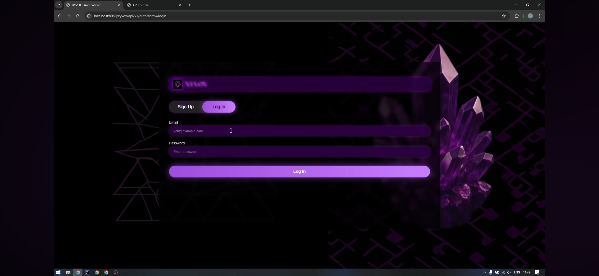
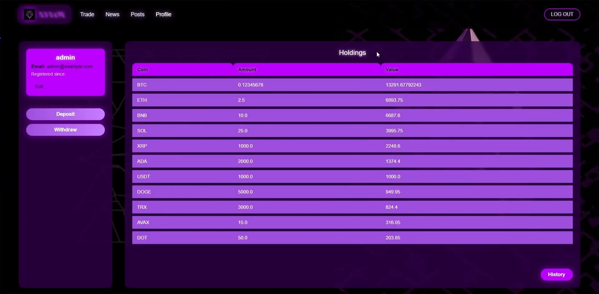
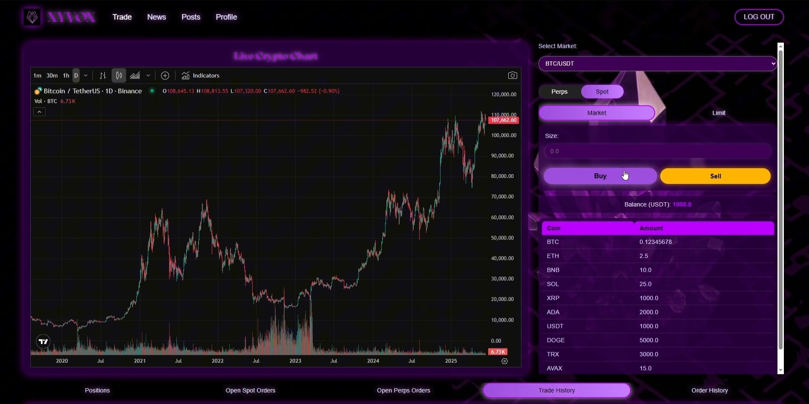
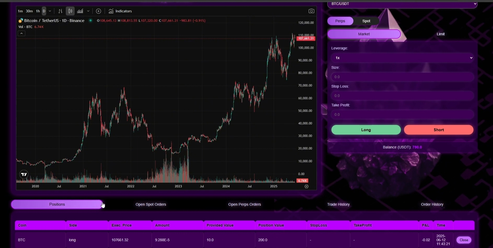
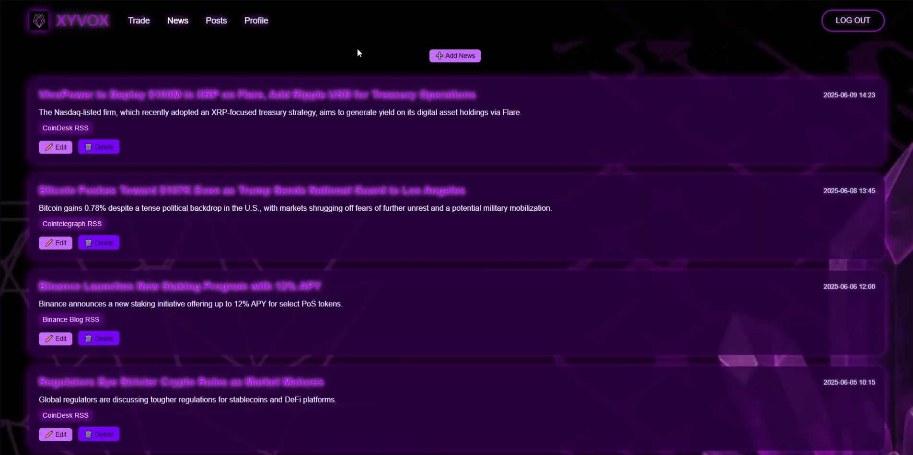
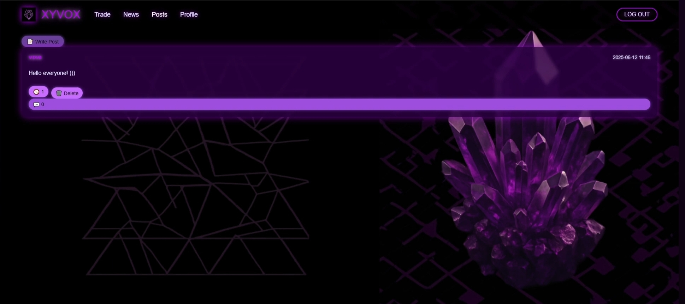
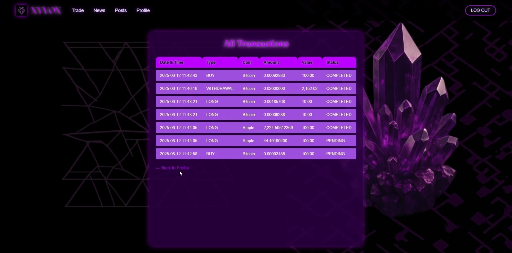

# XYVOX

> Deep within the fractured mesh, XYVOX burns like a silent rune.  
> Those who decode its rhythm unlock more than just data.

XYVOX is a learning-oriented cryptocurrency trading platform that combines:

- spot & futures trading on top of a simulated USDT-based exchange,
- user wallets and transaction history,
- real-time price charts and news,
- a simple social feed for posts, comments and likes,
- role-based administration and moderation.

The goal is to provide a **clean, understandable exchange UI** that feels like a real product, but remains small enough to study, hack on and extend.

**YouTube** : https://youtu.be/sIvQgmowy4g?si=dTeW-l7J0MsTzYyJ

---

## 1. High-level overview

XYVOX targets the **fintech / crypto** area, focusing on users who want:

- an exchange that is not overloaded with features,
- clear visualisation of price and positions,
- basic social interaction around the market.

Typical users:

- **Guest** – can explore public pages (home, news, posts list).
- **Registered user** – trades, manages wallet, posts and comments.
- **Moderator** – moderates posts/comments.
- **Administrator** – full control: roles, coins, platform fees.

---

## 2. Core features

### 2.1 Account & profile

- Registration with **email + password + nickname**.
- Login / logout using JWT authentication.
- Profile: view email, nickname, role, registration date.
- Update nickname and email (email change confirmed via code).
- Two-step password reset (request code + reset with new password).

<!-- Main auth screen with email, password and nickname -->

---

### 2.2 Wallet & balances

Each user has exactly **one wallet**. A wallet holds balances for multiple coins.

Main actions:

- View balances across all coins (USDT + listed cryptocurrencies).
- Generate **deposit address** for selected coin + network (e.g. ERC20).
- Withdraw coins to an external address (with validation and balance checks).
- View full transaction history (deposits, withdrawals, buys, sells, exchanges).

<!-- Profile view with balances, deposit/withdraw controls and history button -->

---

### 2.3 Spot trading

Spot trading is done **against USDT**:

- Market orders – buy/sell immediately at current market price.
- Limit orders – execute only when price reaches the user-defined level.
- Commission fee – automatically applied to executed orders.
- For each coin, user can see open spot orders and available balances.

<!-- Spot trading screen with chart, order form and open orders -->

---

### 2.4 Futures / perpetual trading

XYVOX supports a simplified **perpetual futures** module:

- Long / short positions with configurable leverage (e.g. ×10).
- Market and limit futures orders.
- Stop-loss & take-profit levels.
- Open / close positions with tracking of:
  - entry and exit price,
  - leverage,
  - realized and unrealized PnL,
  - status (open/closed).

---

### 2.5 Market data & charts

- Real-time price charts for each supported coin.
- Multiple timeframes (e.g. minute / hourly / daily).
- Automatic price refresh during active trading.
- Implementation uses **TradingView Lightweight Charts** on the frontend.

The backend exposes endpoints serving current prices and historical OHLC data which are consumed by the chart widget.

---

### 2.6 News feed

A simple **news aggregator** for crypto-related articles:

- Lists latest articles from external, trusted sources.
- Shows: source, title, short summary, URL, publish time.
- Public endpoint – reading news does not require login.

<!-- News screen with list of market articles -->

---

### 2.7 Social feed

XYVOX includes a minimal **social layer**:

- Create text posts with market thoughts or analysis.
- Like posts, see likes count.
- Comment on posts and read threads.
- Edit and delete own posts/comments.
- Moderators and admins can edit/delete any content.

---

### 2.8 Administration & moderation

Admin features:

- Manage users:
  - list users, view full info,
  - change role (Regular / Moderator / Admin),
  - delete accounts.
- Manage coins:
  - list supported coins,
  - add new coin (symbol, name, network, decimals, price),
  - update or remove existing coins.
- Manage global spot & futures **fee settings**.

Moderator features:

- Moderate posts and comments (edit / delete) without access to system-level settings.

---

## 3. Domain model

The main entities and relationships (simplified):

- **User**
  - `id, email, password_hash, nickname, role, created_at`
  - 1-to-1 with **Wallet**
- **Wallet**
  - `id, user_id`
  - 1-to-many with **WalletCoin** and **Transaction**
- **Coin**
  - `id, symbol, name, network, decimals, price, last_updated_at`
- **WalletCoin**
  - `id, wallet_id, coin_id, amount`
  - join between Wallet and Coin
- **Transaction**
  - `id, wallet_id, type, amount, value, coin_id, timestamp, status`
  - covers deposits, withdrawals, spot trades, etc.
- **SpotOrder**
  - `id, user_id, type (market/limit), coin_id, amount, price, status, value, created_at`
- **FuturesOrder**
  - `id, user_id, coin_id, side (long/short), type, price, amount, value, leverage, status, created_at`
- **FuturesPosition**
  - `id, user_id, futures_order_id, entry_price, amount, value, leverage, side, status, stop_loss_price, take_profit_price, exit_price, pnl, opened_at, closed_at`
- **Post / Comment / PostLike**
  - `Post`: basic article with `likes_count`.
  - `Comment`: attached to a `Post` and a `User`.
  - `PostLike`: join between `Post` and `User`.

These entities map to database tables using JPA/Hibernate.

---

## 4. API overview

The backend exposes a REST API under `/api/v1/...`. Below is a **condensed view** of the most important groups.

### 4.1 Auth & user

- `POST /auth/register` – register new user.
- `POST /auth/login` – get JWT token.
- `POST /auth/logout` – invalidate current token.
- `GET /users/my-profile` – get own profile.
- `PATCH /users/my-profile` – change nickname or email.
- `POST /users/my-profile/password-reset` – password reset (request + confirm).

### 4.2 Wallet

- `GET /wallet` – list balances for all coins.
- `GET /wallet/deposit` – get deposit address for a coin + network.
- `POST /wallet/withdraw` – submit withdrawal.
- `GET /wallet/transactions` – list wallet transactions (optional filter by type).

### 4.3 Spot trading

- `GET /trade/spot/{coin_id}` – market data + open spot orders + balances.
- `POST /trade/spot/{coin_id}/orders` – create market or limit order.

### 4.4 Futures trading

- `GET /trade/perps/{coin_id}` – market data + open futures orders + positions.
- `POST /trade/perps/{coin_id}/orders` – open leveraged position (market/limit).
- `POST /trade/perps/{coin_id}/positions/{position_id}/close` – close position.

### 4.5 News

- `GET /news` – latest articles (public).

### 4.6 Social

- `GET /posts` – list posts (public, optional auth for “liked_by_user”).
- `GET /posts/{post_id}` – single post with comments.
- `PATCH /posts/{post_id}` / `DELETE /posts/{post_id}` – edit/delete post.
- `PUT /posts/{post_id}/like` / `DELETE /posts/{post_id}/like` – like/unlike.
- `POST /posts/{post_id}/comments` – add comment.
- `PATCH /posts/{post_id}/comments/{comment_id}` – edit comment.
- `DELETE /posts/{post_id}/comments/{comment_id}` – delete comment.

### 4.7 Admin

- `GET /admin/users` / `GET /admin/users/{user_id}` – list or view user.
- `PATCH /admin/users/{user_id}/role` – change role.
- `DELETE /admin/users/{user_id}` – delete user.
- `GET /admin/coins` / `POST /admin/coins` / `PATCH /admin/coins/{id}` / `DELETE /admin/coins/{id}` – manage coins.
- `GET /admin/fees` / `PATCH /admin/fees` – view and update fee configuration.

All state-changing endpoints require `Authorization: Bearer <JWT>`; admin and moderator actions additionally check the `role` claim in the token.

---

## 5. UI / main screens

Below – a suggested structure for screenshots. Paths are just examples; place final images under `docs/screens/` and keep the names or update links above.

1. **Main Page**
   - Branding, quick description, CTA to sign up / log in.

   

2. **Sign Up / Log In**
   - Email + password (+ nickname on sign up).
   - Simple error messages, link to reset password.

   

3. **Futures – Market**
   - TradingView chart on the left.
   - Market order form with side (long/short), amount, leverage.
   - List of open positions below.

   

4. **Futures – Limit**
   - Same layout, but limit order form with price, stop-loss, take-profit.

5. **Spot – Limit**
   - Chart + limit order form for regular spot trading.
   - Open spot orders and recent trades.

   

6. **News**
   - Scrollable list of crypto news articles with title, source, short text.

   

7. **Posts List**
   - Timeline of posts with short content, author, date and likes.

   

8. **Post with Comments**
   - Selected post at top, comments thread below.

9. **Write Post**
   - Simple textarea + Publish button.

10. **Profile & Wallet**
    - User info, balances, deposit/withdraw block, link to history.

    

11. **Transactions History**
    - Table with columns: coin, amount, type, value, timestamp.

    

---

## 6. Non-functional requirements & guarantees

XYVOX is designed with several important constraints in mind:

- **Security**
  - Passwords stored only as **salted hashes** (BCrypt).
  - All protected endpoints require JWT token.
  - Role-based access control (Regular / Moderator / Admin).
  - HTTPS support via self-signed TLS certificate.

- **Reliability**
  - Error handling for all major endpoints.
  - Logging of user actions and system events (Logback).

- **Scalability**
  - Modular code structure so that new features (staking, new coins, DeFi integrations) can be added without major refactor.

- **Consistency**
  - Wallet updates and trades use **database transactions** (ACID) to prevent partial updates and race conditions.

- **Performance (for demo / local use)**
  - Target: up to ~200 requests/second locally and average API latency below 200 ms.

---

## 7. Technologies

Backend & infrastructure:

- **Java 24 + Spring Boot**
  - `spring-boot-starter-web` – REST layer.
  - `spring-boot-starter-data-jpa` – ORM / MySQL integration.
  - `spring-boot-starter-security` – auth + roles.
  - `spring-boot-starter-websocket` – WebSocket / STOMP for real-time updates.
- **MySQL** – main relational database.
- **JWT** – stateless authentication.
- **BCryptPasswordEncoder** – password hashing.
- **Logback** – logging.
- **SSL/TLS** with `.p12` keystore for HTTPS.

Frontend:

- **HTML5, CSS3, Bootstrap** – layout & styling.
- **TradingView Lightweight Charts** – financial charts via CDN.

---

## 8. Possible extensions

Ideas that naturally follow the current architecture:

- Staking and yield-farming modules.
- On-chain data integration (real prices and trades via Solana/EVM APIs).
- Advanced analytics: portfolio performance, risk metrics, custom indicators.
- More social features: following users, notifications, sharing strategies.
